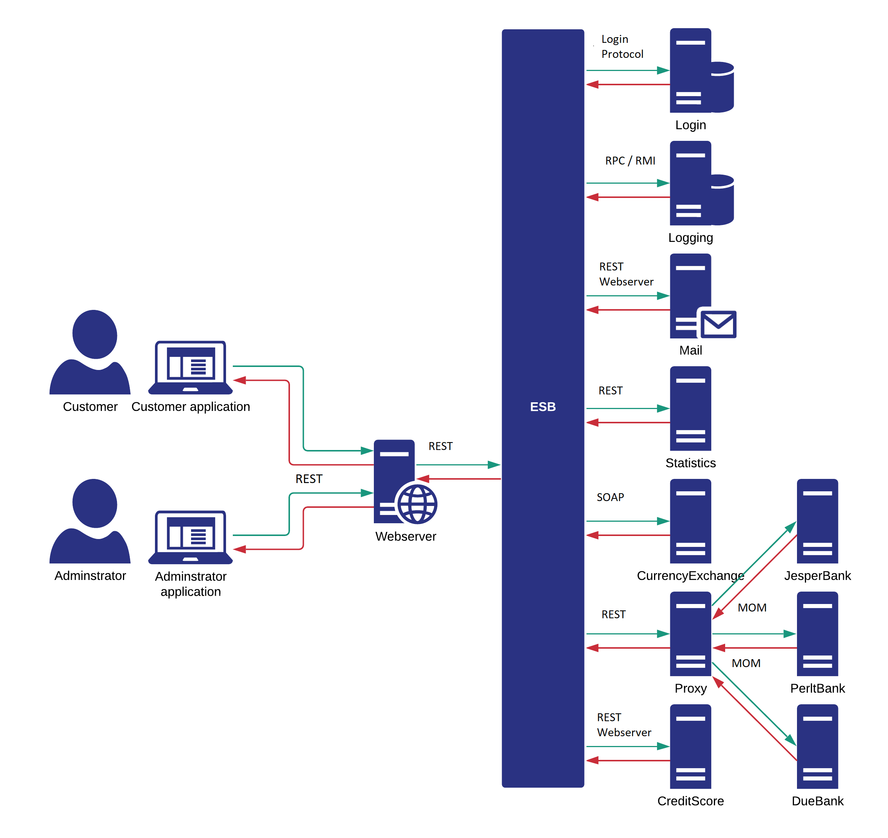
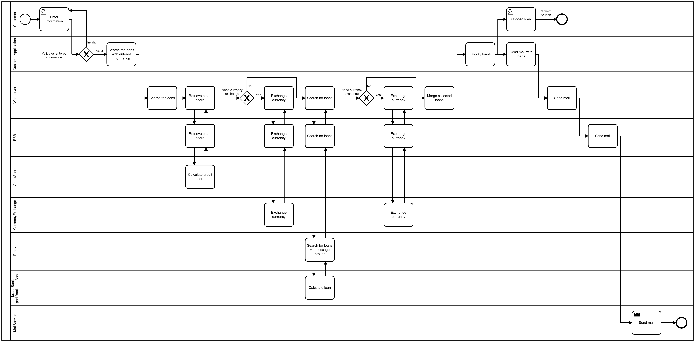

# ExamProject for System - Integration
By Nikolai Perlt, Jesper Rusbjerg & Michael Due Pedersen

## Links and diagrams/models
[Draft to exam project](https://datsoftlyngby.github.io/soft2020fall/resources/3ac43cba-ExamProjectDraft.pdf)

[Exam project UML diagram](https://app.lucidchart.com/lucidchart/invitations/accept/0f1c9112-dbee-416f-b531-6fe8e2ef72d5)



[BPMN Model file](https://github.com/JesperRusbjerg/team7ExamProject/blob/main/searchForLoan.bpmn)



## Microservices

### [Bankster](https://github.com/JesperRusbjerg/team7ExamProject/tree/main/perltBank)

- Language: TypeScript
- Integration: RabbitMQ (MOM)
- Additional: None
- [Not Deployed]()

### [JesperBank](https://github.com/JesperRusbjerg/team7ExamProject/tree/main/jesperBank)

- Language: Node.js
- Integration: RabbitMQ (MOM)
- Additional: None
- [Not Deployed]()

### [DueBank](https://github.com/JesperRusbjerg/team7ExamProject/tree/main/DueBank)

- Language: Python
- Integration: RabbitMQ (MOM)
- Additional: None
- [Not Deployed]()

### [ValutaConverterModule](https://github.com/JesperRusbjerg/team7ExamProject/tree/main/currencyExchangeSOAP)

- Language: Node.js
- Integration: SOAP
- Additional: Webscraping
- [Not Deployed]()

### [BankProxyModule](https://github.com/JesperRusbjerg/team7ExamProject/tree/main/bankProxy)

- Language: TypeScript
- Integration: REST
- Additional: None
- [Deployed](http://104.248.139.111:3000/)

POST
```json
{
    "amount": 10000,
    "creditScore": 11,
    "type": "quick"
}
```

### [CreditScoreModule](https://github.com/JesperRusbjerg/team7ExamProject/tree/main/CreditScoreModule)

- Language: Java
- Integration: REST
- Additional: None
- [Deployed](https://www.mdp-creations.dk/creditScoreModule/)


### [StatisticsModule](https://github.com/JesperRusbjerg/team7ExamProject/tree/main/statisticsRest)

- Language: Java
- Integration: RPC
- Additional: None
- [Not Deployed]()

### [MailModule](https://github.com/JesperRusbjerg/team7ExamProject/tree/main/EmailModule)

- Language: ?
- Integration: ?
- Additional: None
- [Not Deployed]()

### [LoggingModule](https://github.com/JesperRusbjerg/team7ExamProject/tree/main/logsRpc)

- Language: Java
- Integration: RPC
- Additional: None
- [Not Deployed]()

### [LoginModule](https://github.com/JesperRusbjerg/team7ExamProject/tree/main/login-module)

- Language: C#
- Integration: TCP
- Additional: Custom protocol
- [Not Deployed]()

### [Webserver ("Momondo")](https://github.com/JesperRusbjerg/team7ExamProject/tree/main/webserver)

- Language: ?
- Integration: ?
- Additional: None
- [Not Deployed]()

### [ESB](https://github.com/JesperRusbjerg/team7ExamProject/tree/main/esb)

- Language: ?
- Integration: ?
- Additional: None
- [Not Deployed]()

### [CustomerApplication](https://github.com/JesperRusbjerg/team7ExamProject/tree/main/customerApplication)

- Language: React.js
- Integration: HTTPS
- Additional: Ant.Designs
- [Deployed](http://mdp-creations.surge.sh/)

### [AdminstratorApplication](https://github.com/JesperRusbjerg/team7ExamProject/tree/main/adminstration-application)

- Language: Vue.js
- Integration: HTTPS
- Additional: Vuex, Vuetify
- [Deployed](https://team7-adminstrator.netlify.app/)
